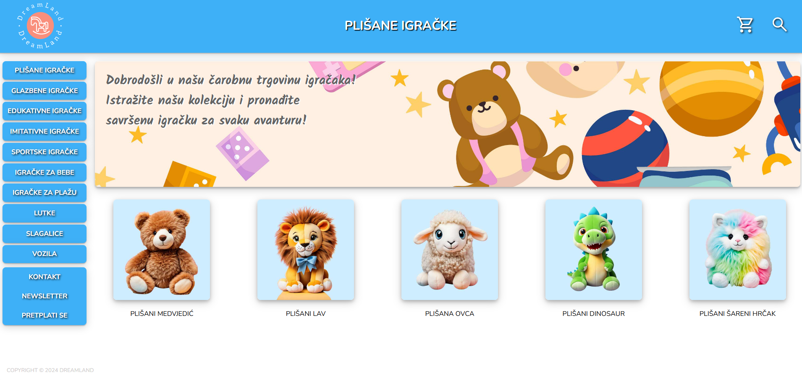
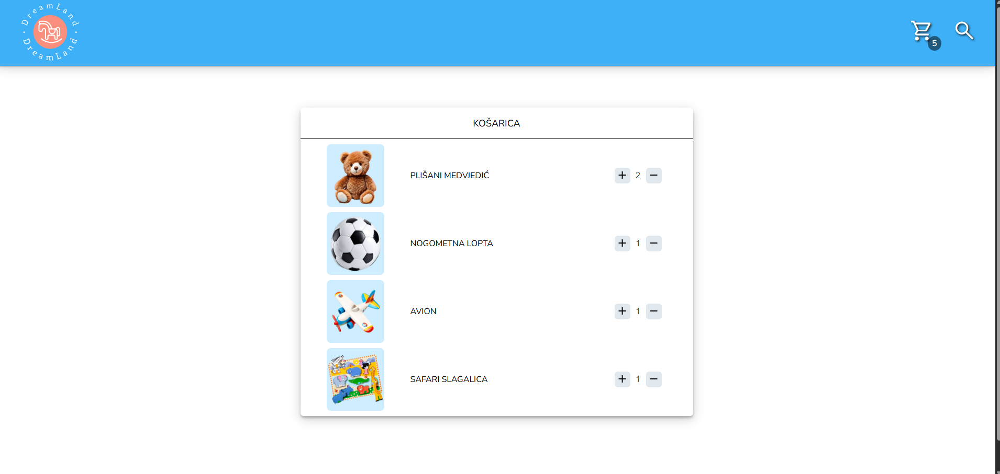

# Basic WebShop App with ToyShop theme

A simple web application built with Express and EJS as part of the course "Software Development for the Web" at the Faculty of Electrical Engineering and Computing, University of Zagreb.



## Features

- View product categories
- Shopping cart functionality
- Session management
- Dynamic HTML rendering using EJS

## Getting Started

### Prerequisites

- Node.js and npm installed

### Installation

1. Clone the repository or download the ZIP.
2. Navigate into the project folder.
3. Run:

   ```bash
   npm install
4. Start the server:
   ```bash
   node server.js
5. Open your browser and go to:
   http://localhost:3000
